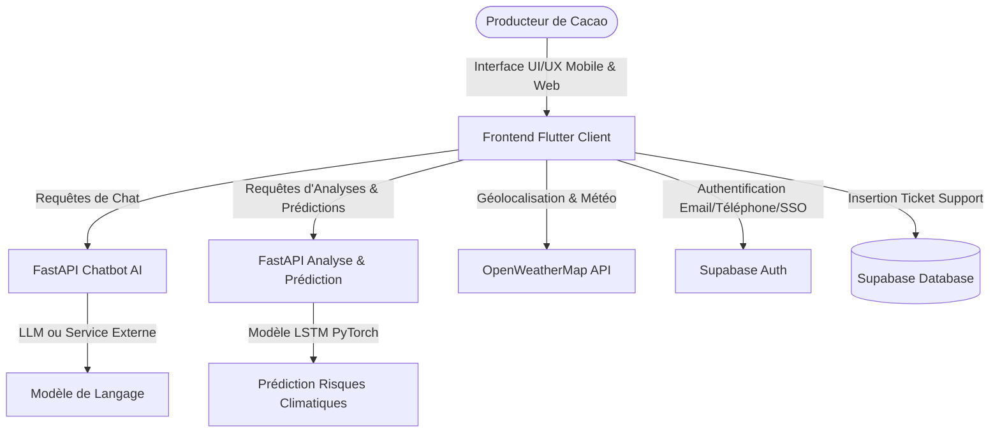

# 🌿 Cacao AI (Azur) — Plateforme d'Aide à la Décision Agronomique

**Cacao AI** (nom de code *Azur*) est une plateforme d'aide à la décision agronomique moderne, intelligente et robuste conçue pour accompagner les producteurs de cacao en Côte d'Ivoire dans la détection des maladies du cacaoyer et le suivi agro-climatique en temps réel.

La plateforme combine la puissance de l'intelligence artificielle locale (modèle TFLite de vision par ordinateur), de modèles prédictifs (FastAPI + LSTM) et d'un chatbot agronomique connecté.

---

## 📐 Architecture du Projet



La plateforme est composée de trois modules principaux :
1. **`cacao_ai_flutter`** : Client mobile (Android/iOS) et Web premium construit en Flutter, utilisant Material Design 3.
2. **`analyse_ai`** : Backend API FastAPI (Port 8000) dédié à l'évaluation des risques de maladies et d'analyses météorologiques prédictives.
3. **`chatbot_ai`** : Backend API FastAPI (Port 8001) propulsant l'assistant conversationnel agronomique.

---

## ✨ Fonctionnalités Majeures

### 🔒 Authentification Unifiée & Sécurisée (Airbnb-Style)
* Inscription et Connexion fluides avec bascule dynamique entre **E-mail** et **Numéro de téléphone (Côte d'Ivoire)**.
* Support complet de la réinitialisation de mot de passe par **code de récupération OTP (SMS & E-mail)**.
* Connexion SSO tierce (**Google** et **Facebook**).
* Gestion des profils centralisée via les métadonnées utilisateurs Supabase.

### 📸 Diagnostic de Maladies par Intelligence Artificielle
* **Modèle local TFLite** : Détection instantanée sur les cabosses et feuilles via l'appareil photo ou la galerie.
* **Classes de maladies supportées** : Pourriture brune (Phytophthora), Maladie du balai de sorcière, Swollen Shoot (CSSV), etc.
* **Indicateur de sévérité** : Évaluation dynamique du pourcentage de la zone infectée.
* **Scénarios de secours (Fallback)** : Simulation interactive en cas d'absence ou de non-chargement du fichier de modèle TFLite sur certaines plateformes (comme le Web).

### ⛅ Météo Intelligente & Géolocalisation Réelle
* Localisation automatique via le GPS de l'appareil (à l'aide du package `geolocator`).
* Récupération automatique de la météo actuelle et des prévisions via **OpenWeatherMap API**.
* Résolution dynamique du nom de la ville (ex: Abidjan, San Pédro) et adaptation de l'interface en fonction des données météorologiques de la plantation.

### 💬 Aide, Support & Assistance Intégrée
* Un bouton **Aide & Support** dans les paramètres permet aux producteurs d'envoyer des messages en cas de difficultés techniques.
* Les messages de ticket sont insérés directement en base de données Supabase avec les coordonnées du producteur.

---

## 📂 Structure du Répertoire

* **`cacao_ai_flutter/`** : Code source complet de l'application Flutter.
* **`analyse_ai/`** : API FastAPI d'analyse et de prédiction des risques.
* **`chatbot_ai/`** : API FastAPI d'assistance conversationnelle.
* **`training/`** : Scripts Python d'entraînement et d'export du modèle d'IA au format TFLite.
* **`start_project.sh`** : Script d'automatisation global de l'environnement (installation des dépendances et lancement simultané).

---

## ⚙️ Installation et Configuration Rapide

Le projet est livré avec un orchestrateur de démarrage automatique. Vous n'avez pas besoin d'installer manuellement les bibliothèques une par une.

### 1. Prérequis
Assurez-vous d'avoir installé sur votre machine :
* **Flutter SDK** (version 3.10 ou supérieure)
* **Python** (version 3.9 ou supérieure)

### 2. Configuration des Clés & APIs
Éditez le fichier de configuration global de l'application Flutter situé à l'emplacement suivant :
📂 **`cacao_ai_flutter/assets/config.json`**

Configurez-y vos propres clés Supabase et OpenWeatherMap :
```json
{
  "supabase_url": "https://votre-projet.supabase.co",
  "supabase_anon_key": "votre-cle-anonyme-supabase",
  "predict_api_url": "http://127.0.0.1:8000",
  "chat_api_url": "http://127.0.0.1:8001",
  "weather_api_key": "20a888e496db2b7661e906ae3ae352bc"
}
```

### 3. Triggers SQL Supabase (Optionnel mais Recommandé)
Pour un fonctionnement optimal de la base de données, exécutez le script SQL suivant dans le **SQL Editor** de votre console Supabase afin de créer automatiquement les profils utilisateurs et la table de support technique :

```sql
-- Création de la table des profils publics
create table public.profiles (
  id uuid references auth.users on delete cascade primary key,
  username text,
  email text,
  phone text,
  created_at timestamp with time zone default timezone('utc'::text, now()) not null
);

-- Fonction de trigger d'inscription
create or replace function public.handle_new_user()
returns trigger as $$
begin
  insert into public.profiles (id, username, email, phone)
  values (
    new.id,
    new.raw_user_meta_data->>'username',
    new.email,
    new.phone
  );
  return new;
end;
$$ language plpgsql security definer;

-- Association du trigger à l'inscription de Supabase Auth
create trigger on_auth_user_created
  after insert on auth.users
  for each row execute procedure public.handle_new_user();

-- Création de la table des tickets de support
create table public.support_tickets (
  id bigint generated always as identity primary key,
  user_id uuid references auth.users(id) on delete set null,
  email text,
  phone text,
  category text,
  message text,
  created_at timestamp with time zone default timezone('utc'::text, now()) not null
);
```

---

## 🚀 Lancement Automatisé du Projet Complet

À la racine du projet, lancez simplement le script `start_project.sh`. Ce script va :
1. Installer automatiquement les dépendances Python nécessaires dans des environnements virtuels (`venv`).
2. Lancer l'API d'Analyse sur le port **8000**.
3. Lancer l'API du Chatbot sur le port **8001**.
4. Mettre à jour les dépendances Flutter (`flutter pub get`).
5. Lancer l'application Flutter en mode développement.

```bash
chmod +x start_project.sh
./start_project.sh
```

---

## 🛠️ Lancement Manuel (Étape par Étape)

Si vous préférez lancer chaque composant individuellement :

### Étape 1 : Démarrer le Service d'Analyse (FastAPI)
```bash
cd analyse_ai
python3 -m venv venv
source venv/bin/activate
pip install -r requirements.txt
uvicorn app:app --host 127.0.0.1 --port 8000 --reload
```

### Étape 2 : Démarrer le Service Chatbot (FastAPI)
```bash
cd chatbot_ai
python3 -m venv venv
source venv/bin/activate
pip install -r requirements.txt
uvicorn app:app --host 127.0.0.1 --port 8001 --reload
```

### Étape 3 : Exécuter l'application Flutter
```bash
cd cacao_ai_flutter
flutter pub get
flutter run
```

---

## 🧠 Entraînement et Export du Modèle d'IA (TFLite)
Le dossier `training` fournit des scripts Python autonomes pour préparer vos jeux de données et ré-entraîner le classificateur de maladies :
1. **`01_prepare_data.py`** : Organise les images de cabosses en jeux d'entraînement/validation.
2. **`02_train_model.py`** : Entraîne le réseau neuronal profond (MobileNetV2 / ResNet).
3. **`03_export_tflite.py`** : Quantifie et exporte le modèle entraîné sous format léger `.tflite`.
   * Le fichier produit doit être placé dans `cacao_ai_flutter/assets/models/cacao_model.tflite` pour être chargé par l'application.

---

## 🔒 Sécurité et Bonnes Pratiques
* Le fichier `cacao_ai_flutter/assets/config.json` contient des clés API et ne doit idéalement pas être poussé en public sur un dépôt de production (utilisez des variables de secrets en CI/CD).
* Toutes les requêtes HTTP externes s'exécutent avec des mécanismes de retry en cas de perte de connexion réseau dans les plantations.